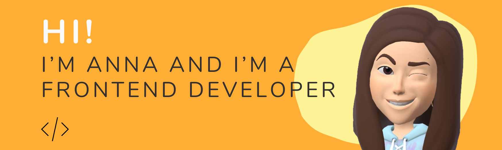

###

  

###

<h2 align="left">✨ About me</h2>

###

###

💻. I program in React (Ts and Js) 🌙. I'm 20 years old 👩‍🎓. I'm a student of Systems Engineering and IT technician

###

  
  

###

<h2 align="left">💻 Tech Stack</h2>

###

  
  
  
  
  
  
  
  
  
  
  
  
  
  
  
  
  
  
  
  
  
  
  
  
  
  
  
  
  
  
  
  
  
  
  

###

<h2 align="left">👥 Follow Me</h2>

###

  

###

  

###
